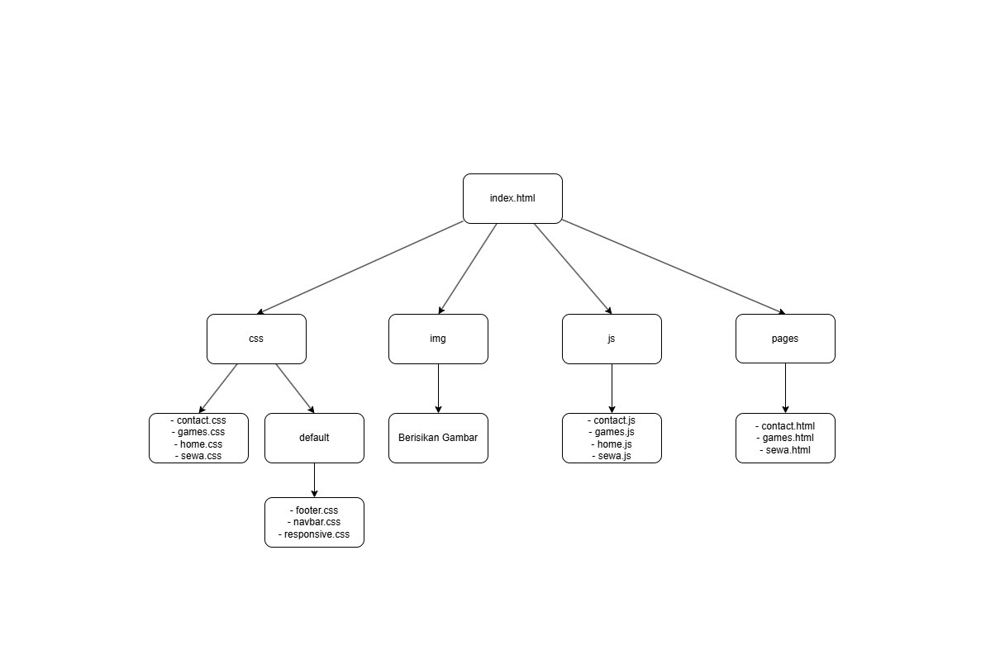

# **Judul: Game ON! - Website Rental PlayStation**

Platform online untuk menyewa PlayStation. Dan juga menjual kaset ps 4 dan 5.

## **Anggota Kelompok 1**
| NPM          | Nama                                                        |
| ------------ | ----------------------------------------------------------- |
| 202243500497 | [Alfarobby](https://github.com/Alfarobby27)                 |
| 202243500500 | [Ahmad Badawi](https://github.com/Ahmadbadawi123)           |
| 202243500501 | [Abdur Rosyid Fachriansyah](https://github.com/dellwatch21) |
| 202243500502 | [Sangga Buana](https://github.com/sanggabuana453)           |
| 202243500505 | [Taufik Ramadhan](https://github.com/Alfarobby27)           |  
| 202243579068 | [Agus Setiawan](https://github.com/Alfarobby27)             |
| 202243500498 | [Khoirizidan Nur Bisri](https://github.com/Alfarobby27)     |

## **Fitur Menu:**
- Home: Halaman utama website sebagai informasi utama seperti tentang website, keunggulan, testimonial customer, dan sponsors. 
- Games: Halaman untuk membeli kaset ps 4 dan 5.
- Sewa: Halaman untuk menyewa ps. 
- Contact: Halaman kontak pesan rental ps.

## **Teknologi yang digunakan:**
- HTML: - HTML Dasar
        - HTML5

- CSS: - CSS Dasar
       - CSS3
       - CSS Layouting
       - CSS Flexbox
       - CSS Grid
       - CSS Unit

- Javascript:
        - Javascript Dasar
        - Javascript DOM   (Document Object Model)
        - Javascript Standard Library

- Icon: - Font Awesome
        - Lottie Files

- Jenis Font: Arial, Helvetica, sans-serif

## **Struktur Folder**


## **Demo Website**

```bash
https://alfarobby27.github.io/game-on/
```
